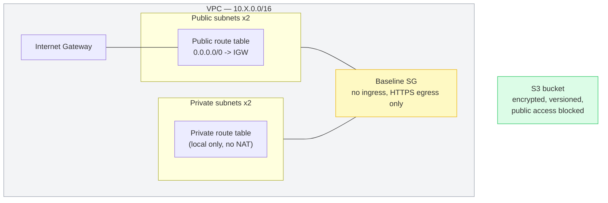

# AWS Multi-Environment Pipeline

A Terraform-managed AWS network baseline (VPC, subnets, a locked-down
security group, an encrypted S3 bucket) promoted through **dev → staging →
prod** by a GitHub Actions pipeline with real gates — not three copies of
the same `terraform apply` run by hand.

## Why this project

Every other infrastructure project in my portfolio proves I can build
something that works once, verified by destroying and reapplying from a
clean environment. None of them prove I can operate something as it moves
through the promotion path a real team actually uses day to day: does a
change survive dev, does it survive staging, and does getting it to
production require a human to actually look at it first. This project is
about the *pipeline*, not the infrastructure — the baseline network it
deploys is deliberately minimal (see [What's real vs. simplified](#whats-real-vs-simplified))
so the promotion mechanics stay the focus.


## What "real gates" means here

1. **Validate** (every PR and push): `terraform fmt -check`, `terraform validate`
   for all three environments, and a Checkov policy scan. Nothing downstream
   runs if this fails.
2. **Dev**: auto-applies on push to `main` once validate passes. No human
   in the loop — this is the "move fast" end of the pipeline.
3. **Dev → staging**: automatic, but only if dev's **smoke test** passes —
   a post-apply script that checks the *live* AWS resources (not just that
   `terraform apply` exited 0) against what the environment is supposed to
   look like: correct CIDR, correct tags, zero ingress rules on the baseline
   security group, S3 public-access-block fully enabled, encryption and
   versioning on. `terraform apply` succeeding means AWS accepted the API
   calls, not that the result is actually correct — the smoke test is what
   closes that gap.
4. **Staging → prod**: requires a human to click approve. This is a GitHub
   Environments protection rule, not application logic — see
   [One-time setup](#one-time-setup) below.

```
PR / push to main
        │
        ▼
   validate (fmt, validate, checkov) ──── fails ──▶ nothing deploys
        │ passes
        ▼
   deploy-dev (auto-apply) ──▶ smoke test ──── fails ──▶ pipeline stops here
        │ passes
        ▼
   deploy-staging (auto-apply) ──▶ smoke test ──── fails ──▶ pipeline stops here
        │ passes
        ▼
   [ WAITING FOR REVIEW — human approval required ]
        │ approved
        ▼
   deploy-prod (apply) ──▶ smoke test
```

## Architecture (per environment)



Same module (`modules/vpc-baseline`), three different parameter sets:

| | dev | staging | prod |
|---|---|---|---|
| VPC CIDR | `10.10.0.0/16` | `10.20.0.0/16` | `10.30.0.0/16` |
| State key | `envs/dev/terraform.tfstate` | `envs/staging/terraform.tfstate` | `envs/prod/terraform.tfstate` |
| Approval required | No | No | **Yes** |


## What's real vs. simplified

Being upfront about the difference between this and what a platform team
would actually run:

- **No NAT Gateway.** The private subnets exist and route locally, but
  nothing in them needs outbound internet for this baseline, so there's no
  NAT Gateway (~$32/month each) burning cost across three environments for
  a demo. A real workload placed in these subnets would need one added.
- **One shared Terraform module, minimal surface.** The point of this
  project is the promotion pipeline, not another networking deep-dive —
  see my [aws-hybrid-network-architecture](https://github.com/gkoufie1/aws-hybrid-network-architecture)
  project for that. This baseline is deliberately small: a VPC, subnets, one
  security group, one S3 bucket.
- **PR validation doesn't run `terraform plan` against real AWS.** It's
  `fmt` + `validate` + Checkov (no cloud credentials needed on PRs, which
  also means no risk of a PR from anywhere getting AWS access). Plan output
  is only visible in the apply logs after merge, not before — a real setup
  would add a plan step gated to trusted PRs.
- **Same IAM role across all three environments**, for simplicity. A
  stricter setup would scope a separate least-privilege role per
  environment via GitHub Environment-level secrets, so a compromised dev
  credential can't touch prod.

## One-time setup

**1. Bootstrap the state bucket** (once, before the first pipeline run):

```bash
aws s3api create-bucket --bucket gkoufie-multi-env-pipeline-tfstate --region us-east-1
aws s3api put-bucket-versioning --bucket gkoufie-multi-env-pipeline-tfstate \
  --versioning-configuration Status=Enabled
aws s3api put-bucket-encryption --bucket gkoufie-multi-env-pipeline-tfstate \
  --server-side-encryption-configuration '{"Rules":[{"ApplyServerSideEncryptionByDefault":{"SSEAlgorithm":"AES256"}}]}'
```

**2. GitHub OIDC role for Actions** — same pattern as my portfolio site's
deploy pipeline: an IAM role trusted for `token.actions.githubusercontent.com`,
scoped to this repo, with permissions for VPC/EC2/S3 resources. Add its ARN
as a repository secret named `AWS_ROLE_ARN`.

**3. The actual gate — GitHub Environments:**
   - Repo → **Settings → Environments → New environment** → name it `dev`
   - Repeat for `staging`
   - Repeat for `production` (must be exactly this name — it's what
     `deploy-prod` in the workflow references) — then check
     **"Required reviewers"** and add yourself. This is the step that
     actually makes staging → prod pause for a human click; without it,
     the `environment: production` block in the workflow does nothing.

**4. Push to `main`.** The pipeline runs dev → staging automatically, then
   waits at prod for you to approve it in the Actions tab.

## Cost

VPC, subnets, route tables, security groups, and Internet Gateways are free.
The only billed resource is the S3 bucket, which is empty and versioned —
effectively $0/month across all three environments at this scale. Running
`terraform destroy` in each `envs/*` directory tears everything down.

## Repository structure

```
├── modules/
│   └── vpc-baseline/        # The one module all three environments call
├── envs/
│   ├── dev/                 # Separate state, separate backend key
│   ├── staging/
│   └── prod/
├── scripts/
│   └── smoke_test.py        # Post-apply verification against live AWS
└── .github/workflows/
    └── pipeline.yml         # validate -> dev -> staging -> [approval] -> prod
```

